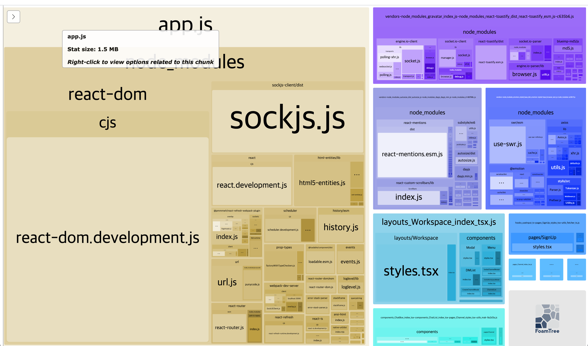

# 어디서나 적용가능한 front 구성하기

<p>강의의 주차 별로, 다운 받는 라이브러리와 해당 내용에 대해 정리합니다. 슬랙 클론 강의가 CRA 없이 npm init 단계부터 시작이기 때문에 다운 받는 라이브러리에 대해 정리하고 공부하며, 스스로 라이브러리를 다운 받아 정리할 수 있도록 노력합니다.</p>

## 1. downloaded dependencies, 프론트엔드 세팅하기

- "@types/react"
- "@types/react-dom"
- "react"
- "react-dom"
- "typescript

- eslint // 코드 검사 도구
- eslint-plugin-prettier
- eslint-config-prettier
- prettier // 코드 정렬 도구

<hr/>

## 2. downloaded dependencies, babel과 webpack tjfwjdgkrl

- @babel/preset-env
- cross-env
- css-loader

> dev dependencies

- @babel/core
- @babel/preset-react
- @babel/preset-typescript
- @types/node
- @types/webpack
- babel-loader
- webpack
- webpack-cli

<hr/>

## 3. downloaded dependencies, 웹펙 데브 서버 세팅하기

- @pmmmwh/react-refresh-webpack-plugin
- @types/webpack-dev-server
- react-refresh
- fork-ts-checker-webpack-plugin
- webpack-cli
- webpack-dev-server

> scripting 명령어 "dev" 추가

<hr/>

## 4. downloaded dependencies, 폴더 구조와 리액트 라우터

-react-router
-react-router-dom

-@types/react-router
-@types/react-router-dom

> 리액트 라우터 돔을 활용하여 기본적인 폴더 구조화

<hr/>

## 5. downloaded dependencies, 코드 스플리팅과 이모션

- @emotion/babel-plugin
- @emotion/react
- @emotion/styled
- @loadable/component
- @types/loadable\_\_component

> loadable 라이브러리르 적용하여 코드스플리팅을 통해 웹팩에서 관리

<hr/>

## 6. downloaded dependencies, axios로 요청 보내기

- axios

## 7. downloaded dependencies, swr 사용하여 쿠키 공유하기

- swr

> <a href="https://github.com/gregrickaby/swr-examples" target="_blank">SWR 깃허브 살펴보기</a>

<p>redux-saga, redux-thunk, context-api 등 비동기를 처리해주는 다양한 라이브러리가 있지만, 이번에는 SWR을 사용했습니다. 기존에 사용했던 리덕스 사가는 액션에 의해 업데이트 된 상태 state를 계속 가지고 있으므로 그 상태가 유지됐습니다. 하지만, SWR에서는 그러한 기능을 자동적으로 해주지 않기 때문에 fetcher라는 모듈을 만들어, 백엔드에서 지속적으로 로그인 상태를 유지할 수 있도록 만들었습니다.</p>

## 8. downloaded dependencies 웹팩 번들 분석기를 통해 빌드한 파일 용량 관리하기

- webpack-bundle-analyzer

<p>웹팩 번들 애널라이저<b>(이하 분석기로 칭함)</b>를 통해 우리는 우리가 배포할 front 부분의 어플리케이션의 용량을 관리 및 분석할 수 있습니다.</p>

```
npm run build
```

<p>라는 명령어를 통해서도 빌드를 할 수 있지만, 우리가 사용하는 dev-mode (개발모드) 일 때도 속성을 추가함에 따라 사용할 수 있습니다.</p>

<p>분석기를 사용하여 dev-mode 또는 빌드 시에 우리의 어플리케이션이 각각 어떤 파일에 어떤 라이브러리가 들어 있고 용량을 얼마나 차지하는지 볼 수 있습니다.</p>



<p>전 프로젝트에서 사용해보아서 알지만, 한 파일이 <b>1MB</b>를 넘으면 충분히 줄여줘야할 필요성을 느낍니다. 한국뿐만 아니라 전세게에서 사용되기 위해서는 상대적으로 느린 인터넷 속도에도 금방 켜질 수 있는 적응 용량으로 최대 효율을 내는 것이 중요합니다.</p>

```
$ npm run build
```

<p>명령어를 통해 배포환경에서 빌드되면 얼마나 용량이 줄어들 지 확인해봅시다.</p>


<p>빌드 후에는 app.js의 용량이 50KB대로 줄어든 것을 볼 수 있습니다. 여기서 중요한 점은 빌드를 하게되면 최종적으로 배포 바로 직전단계이므로, 빌드까지 된 상태에서 용량이 기준 (1MB)보다 초과한다면 줄이기 위해 노력해야 한다는 것입니다. dev-mode 상황에서 아무리 용량을 줄여봤자, build시에 알아서 최적화를 통해 줄어드는 부분이 있기 때문입니다.</p>

<p>이렇게 한 파일(나무)에 달려있는 큰 용량의 라이브러리를 최적화하는 행위를 <b>tree-shaking</b> 이라고 합니다. 최적화를 하기 위해 중요한 부분이지만, 초보 개발자로써 아직 배울 부분이 많기 때문에 상대적으로 중요한 공부들이 마무리 된다면 그때 배우셔도 좋습니다.</p>

> 검색 시에 react-mentions tree-shaking 으로 구글링을 하면 다양한 자료들을 볼 수 있습니다.

## 꿀팁

### 👉🏼 package-lock.json??

<p>npm i/ yarn add 와 같은 명령어를 통해 라이브러리를 다운 받게 되면, 해당 라이브러리들이 node_modules 폴더에 저장됩니다. 독립적으로 해당 라이브러리만 사용하여 구현되는 기능들도 있지만, 일부 라이브러리들은 다른 라이브러리와 의존성 관계를 맺고 있습니다.(참고하여 만들어 짐) 그러한 라이브러리들의 관계를 나타낸 것이 <b>package-lock.json</b> 입니다.</p>

### 라이브러리 다운 시 -D, 와 일반의 차이

<p>우리가 만든 프로젝트 파일을 라이브러리로 만들어 배포할 때는 -D (개발 환경에서만 실행)으로 구분해주는 것이 좋지만, 실무에서 서비스할 때는 너무 엄격하게 구분할 필요는 없습니다.</p>

### custom hooks 만들기

<p>기존의 useInput(useState와 onChange를 관리하기 위헤 만든 커스텀 훅)에 타입을 대입만 대입하면 다음과 같다. 타입스크립트는 기본적으로 파라미터에 대한 타입과 반환값에 대한 타입을 정리해 줘야 하므로 해당 타입을 <T>, 즉 제네릭으로 설정하여 어떤 타입이 들어오더라도 <T> 자리에 있는 타입이 같은 타입의 결과를 반환할 수 있도록 만들어 주었다.</p>

```ts
import { useState, useCallback, Dispatch, SetStateAction } from 'react';

const useInput = <T = any>(initialValue: T): [T, (e: any) => void, Dispatch<SetStateAction<T>>] => {
  // initialValue로 string 값이 온다면 generics가 string으로 변환됨
  const [value, setValue] = useState(initialValue);
  const handler = useCallback((e) => {
    setValue(e.target.value);
  }, []);
  return [value, handler, setValue];
  // (return 값, 즉 반환 값에 대한 타입스크립트의 타이핑 처리라고 보면 된다.)
  // [T, (e: any) => void, Dispatch<SetStateAction<T>>]
};

export default useInput;
```

<p>만일 반환 값을 나타내는 타입 부분이 너무 길다면 타입선언을 통해 따로 빼줄 수 있다.</p>

```ts
import { useState, useCallback, Dispatch, SetStateAction } from 'react';

type ReturnTypes<T = any> = [T, (e: any) => void, Dispatch<SetStateAction<T>>];

const useInput = <T = any>(initialValue: T): ReturnTypes<T> => {    // return 되는 값의 타입선언을 위로 따로 빼주어 해당 명(ReturnTypes)을 바로 사용했다
 ...
 return [value, handler, setValue];
}

```

### 모달 만들기

<p>우리는 슬랙 슬론 코딩에서 빼놓을 수 없는 기능인 모달창을 만들어야 합니다. 기존에 'antd'와 같은 CSS FRAMEWORK를 썼다면 버튼 하나로, 마우스 호버로 모달창을 표시할 수 있었습니다. 하지만, 이번에는 리액트에서 모달 사용하는 법을 완벽히 이해하고자 모달창을 구현해 봅니다. 프론트엔드 엔지니어라고 해서, 관련 js 함수나 로직만 구현하는 것이 아닌 디자인까지 신경쓴다면 본인의 능력을 더 확장시킬 수 있을 것입니다.</p>

```js
const [showUserMenu, setShowUserMenu] = useState(false); // 토글 함수 상태값 저장

...

const onClickUserProfile = useCallback(() => {
  // 토글함수
  setShowUserMenu((prev) => !prev);
}, []);

  const onLogout = useCallback(() => {
    axios
      .post('http://localhost:3095/api/users/logout', null, {
        withCredentials: true,
      })
      .then(() => {
        mutate(false, false);
        // redux-saga에서 me 와 같은 나의 정보가 들은 state의 역할을 SWR에서는 useSWR()이 하게 됨
      });
  }, []);

...

<Header>
  <RightMenu>
    <span onClick={onClickUserProfile} style={{ cursor: 'pointer' }}>
      <ProfileImg src={gravatar.url(userData.email, { s: '28px', d: 'retro' })} alt={userData.nickname} />
    </span>
    {showUserMenu && (
      <Menu style={{ right: 0, top: 38 }} show={showUserMenu} onCloseModal={onClickUserProfile}>
        <ProfileModal>
          
          <div>
            <span id="profile-name">{userData.nickname}</span>
            <span id="profile-active">Active</span>
          </div>
        </ProfileModal>
        <LogOutButton onClick={onLogout}>로그아웃</LogOutButton>
      </Menu>
    )}
  </RightMenu>
</Header>
```

<p>구현된 로직은 이렇습니다. </p>

> 메뉴 바의 상태를 나타내는 useState
> 메뉴 바의 상태를 토글로 on/off 할 수 있는 토글함수

1. RightMenu 컴포넌트안에 span 태그를 통해 모달의 상태로 true로 바꿔줄 이미지를 만들어 줍니다.
2. 클릭시에 onClickUserProfile 함수가 호출됩니다.
   > toggle 함수로 현재 상태와 반대를 이루는 boolean 형식의 값을 반환합니다.
3. onClickUserProfile() 함수에 의해 useState로 관리되는 showUserMenu의 값이 true로 바뀝니다.
4. 조건문을 통해 showUserMenu &&, 즉 showUserMenu가 true일 때 해당 로직 ( ... )이 실행됩니다.
5. <ProfileModal>이라는 우리가 만든 이모션 로직을 통해 style 값을 구현합니다.
   > 해당 styled-component 안에는 현재 사용자의 정보 (state)인, userData를 담습니다.
6. 이모션 로직으로 만든 <LogOutButton>을 만들어 주고, 해당 버튼을 클릭 시 로그아웃할 수 있도록 로직을 짜줍니다.
7. 메뉴를 해당 로직과 같이 따로 폴더를 분리한 이유는 현재 layout 외에도 재사용을 하기 위함입니다.

<p>추가 적으로 컴포넌트를 분리할 때는 단일 책임 원칙에 따라 재사용 가능한 부분을 분리하고 나머지를 {children}으로 담아 Wrokspace에서 사용한 것처럼 <Menu> ... </Menu> 안에 담아주시면 됩니다.</p>

```js
case 1: 내 영역을 제외한 다른 부분을 눌렀을 때 모달 닫기

const stopPropagation = useCallback((e) => {
    e.stopPropagation(); // 부모 태그인 <CreatMenu> 로의 이벤트 버블링을 막아주기 위한 함수
  }, []);

if (!show) {
  return null;
}

<CreateMenu onClick={onCloseModal}>
  <div style={style} onClick={stopPropagation}>
    {closeButton && <CloseModalButton onClick={onCloseModal}>&times;</CloseModalButton>}
    {children}
  </div>
</CreateMenu>

// <CreateMenu>와 같이 부모 컴포넌트에 props로 받은 닫기 버튼을 설정하고, 자식 컴포넌트를 누를 때는 반응하지 않도록 stopPropagation 함수를 만들어 줍니다.
```

<a href="https://programmingsummaries.tistory.com/313" target="_blank">e.stopPropagation() 함수 알아보기</a>

### 소켓 io 사용하여 서버와 비동기 통신 이어가기

### @types/ 라이브러리는 언제 install 하나요?

<p>typescript 환경에서 기존 npm에서 제공하는 라이브러리들을 사용할 때, 추가적으로 타입을 위해 설치해야할 때가 있습니다. npm 사이트에서 해당 라이브러리를 검색하여 하나하나 찾아봐도 좋지만, 일단 기존의 방식대로 import하고, 오류나 에러가 감지될 때 해당 에러에 명령대로 npm i --save-dev @types/ ... 를 해주셔도 괜찮습니다.</p>
